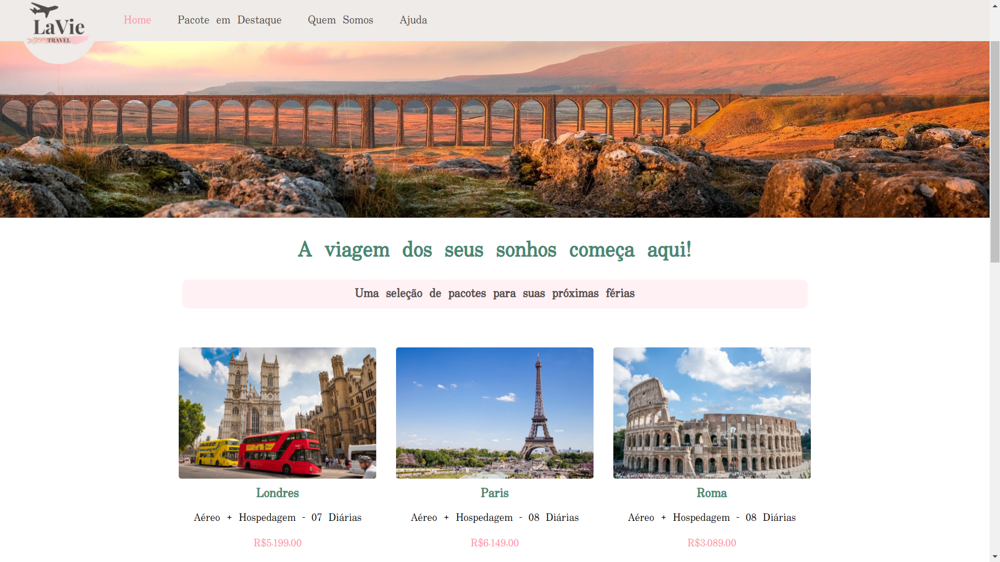
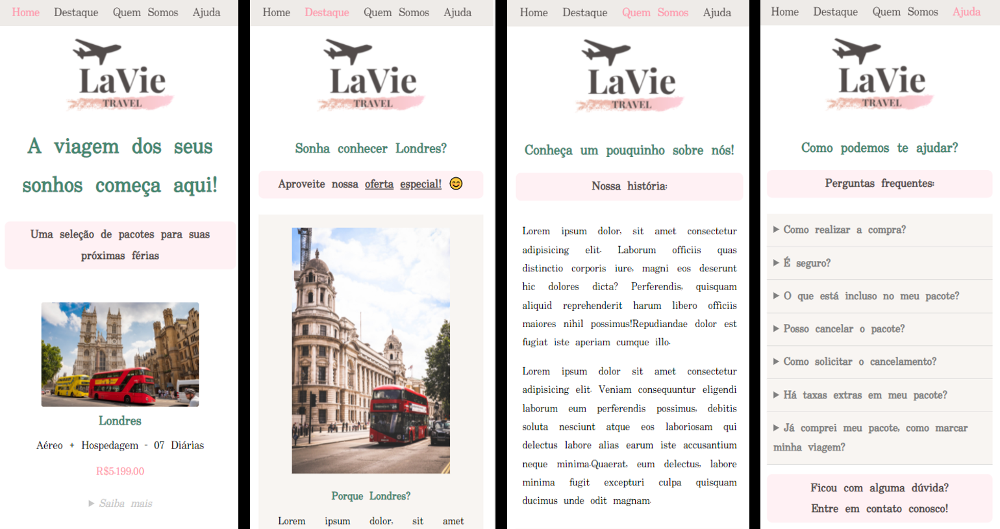

# front-lavie-travel

## Sobre o projeto

Visite a demonstração em: [https://patriciamsro.github.io/front-lavie-travel/index.html](https://patriciamsro.github.io/front-lavie-travel/index.html)

Este site é um projeto proposto na disciplina de Projeto Website Estático ministrada pelo Professor Doutor [Wilton de Paula Filho](http://buscatextual.cnpq.br/buscatextual/visualizacv.do;jsessionid=23B8CCA2A1F5F0657FD8453CC47AF450.buscatextual_0), do curso de `Sistemas para Internet` do `Institudo Federal de Educação, Ciência e Tecnologia do Triângulo Mineiro - IFTM`.

O projeto consiste no desenvolvimento de um site responsivo, de `tema livre`, contendo quatro páginas. Para tal desafio, tive a ideia de criar o site de uma agência de viagens em que busquei aplicar todos conceitos aprendidos durante as aulas.

Desenvolvi esse site utilizando apenas HTML e CSS, totalmente responsivo utilizando flexbox.

Este projeto é de minha autoria em que realizei todo o desenvolvimento técnico (programação) e visual (desenho das telas) e está disponível para a comunidade utilizar.

Todas as imagens foram retiradas dos repositórios de imagens gratuitas abaixo:

* https://unsplash.com/
* https://pixabay.com/pt/images/search/
* https://undraw.co/illustrations
* https://www.flaticon.com/br/

## Mais detalhes

Este é um front-end para uma agência de viagem que disponibiliza pacotes para compra, que é feita via WhatsApp através de um botão que redireciona para um link do WhatsApp da empresa. 

O site conta com uma página inicial que mostra todos os pacotes disponíveis para compra. Além dos pacotes da página inicial, o site dispõe das seguintes páginas:

* Pacote em Destaque: trata-se de uma página exclusiva para uma oferta de um pacote promocional especial, que mostra dicas sobre o destino e detalhes do pacote.
* Quem Somos: é a página que contém a história da empresa, explica os objetivos da empresas e os depoimentos de viajantes que já adquiram algum pacote.
* Ajuda: nesta página encontra-se uma seção de perguntas frequentes sobre as políticas da empresa e dos pacotes, além de contar com um formulário de contato e links para redes sociais.

## Tecnologias utilizadas

* HTML5
* CSS3

## Layout Web

### Tela inicial:


## Layout Mobile:

### Telas mobile:



## Como executar o projeto

Basta fazer o donwload e abrir o `index.html`, porém, se desejar fazer tudo pelo terminal siga o passo a passo abaixo :stuck_out_tongue_winking_eye:: 

### - Windows:

Para clonar o projeto abra o terminal do **git bash**, em seguida faça o clone:
```bash
git clone https://github.com/patriciamsro/front-lavie-travel.git
```

Em seguida, acesse a pasta do projeto:
```bash
cd front-lavie-travel
```

Para abrir o projeto no seu navegador padrão:
```bash
start index.html
```

### - Linux:

Para clonar o projeto abra o terminal, em seguida faça o clone:
```bash
git clone https://github.com/patriciamsro/front-lavie-travel.git
```

Em seguida, acesse a pasta do projeto:
```bash
cd front-lavie-travel
```

Para abrir o projeto no **firefox**:
```bash
firefox index.html
```

Para abrir o projeto no **chrome**:
```bash
google-chrome index.html
```

## Autor

Patrícia Magalhães Sotero Rocha

[](https://www.linkedin.com/in/patr%C3%ADcia-sotero-71a803170/)